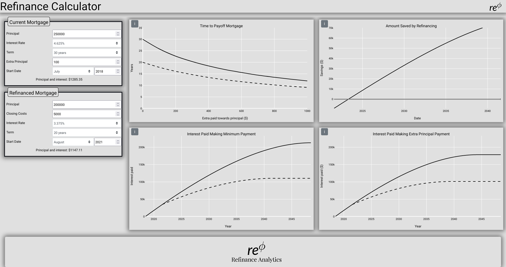

<p align="center">
  
</p>

Rephi is a refinance analysis dashboard designed to help homeowners understand whether refinancing their loan is beneficial. Unlike other refinance calculators, it accounts for accumulation of home equity when determining the breakeven.



This repository also contains a user portal built in Flask for mortgage professionals to create their own custom dashboard. They also get a custom url which can be sent to clients to market their services.

# Getting Started
Clone repository
```console
$ git clone https://github.com/sbarr-apexoptim/Rephi.git
$ cd Rephi
```
Install dependencies in a virtual environment
```console
$ python -m venv venv
$ source venv/bin/activate
$ pip install -r requirements.txt
```
Run the applicaiton
```console
$ python application.py
* Running on http://0.0.0.0:8080/
```
